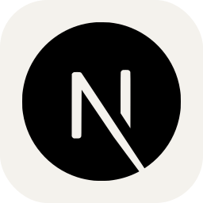
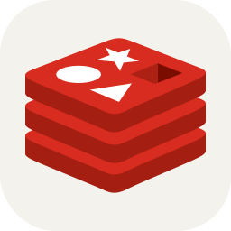
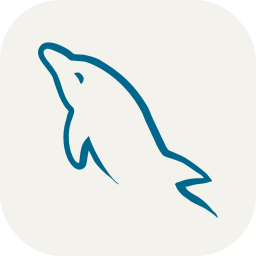

<h2> Hi There, I am Thejas Shetty 👋</h2>

<!---->

## I am a Software Developer and a Computer Science Engineering student with a strong passion for building innovative digital solutions. I focus on solving real-world problems through technology and continuously improve my problem-solving skills by practicing data structures and algorithms on platforms like LeetCode. I am always eager to explore and learn about emerging technologies to enhance my expertise.

<!---->
<!--
 -->

## Tech Stack I am familiar with

 

 
 
 
 
 
 

 
 
 
<!--   -->
<!--   -->
<!--   -->
 
 
 
 
 
 
<!--  
 
  -->
 
 
 
 
 
 

<!---->
<!---->
<!---->
<!---->
<!---->

